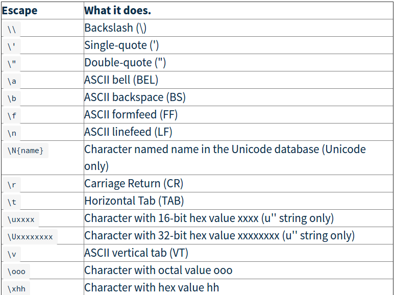

# Input / Output operations in python

---

Python provides numerous built-in functions that are readily available to us at the Python prompt.

Some of the functions like input() and print() are widely used for standard input and output operations respectively.

## I/O functions

- ### print()
  #### The print fn is used to print o/p on the terminal window.
  
  ## `print(*objects, sep=' ', end='\n', file=sys.stdout, flush=False)`
  
  Here:
   `objects` are the values to be printed.
   `sep` separator is used between the values. It defaults into a space character.
   `end` is for to print a specified char at the end of the line.Defaults  to space char.
   `file` object is where the o/p would be printed. It defaults to [sys.stdout]() which is the terminal screen.
   `flush` is used to buffer the o/p ,in file mode only.
   
   ---
   
  #### Use cases.
   
  - `print(1,2,3,4)`
     Output:  `1 2 3 4`

  - `print(1,2,3,4,sep='*')`
     Output:  `1*2*3*4`
  
  - `print(1,2,3,4,sep='#',end='&')`
     Output:  `1#2#3#4&`

  #### O/P formatting using `str.format()`
  
  - Value Substitution 
    `x=5;y=10`
    `print('The value of x is {} and y is {}'.format(x,y))`
     Output:  `The value of x is 5 and y is 10`
     
  - Indexing
    `print('I love {0} and {1}'.format('bread','butter'))`
    `print('I love {1} and {0}'.format('bread','butter'))`
     Output:  `I love bread and butter` `I love butter and bread`
     
  - Keywords
    `print('Hello {name}, {greeting}'.format(greeting = 'Goodmorning', name = 'John'))`
     Output: `Hello John, Goodmorning`
  
  #### O/P formatting using `formatter`
  
   - `formatter = "%r %r %r %r";`
     `print formatter % (1, 2, 3, 4)`
     `print formatter % ("one", "two", "three", "four")`
     `print formatter % (True, False, False, True)`
     `print formatter % (formatter, formatter, formatter, formatter)`
     `print formatter % (`
      `"I had this thing.",`
     `"That you could type up right.",`
     `"But it didn't sing.",`
     `"So I said goodnight."`
     `)`
     
     output: 
      `1 2 3 4`
      `'one' 'two' 'three' 'four'`
      `True False False True`
      `'%r %r %r %r' '%r %r %r %r' '%r %r %r %r' '%r %r %r %r'`
      `'I had this thing.' 'That you could type up right.' "But it didn't sing." 'So I said goodnight.'`
  
  #### C `printf` style string formatting.
  
  - `x = 11.235756`
    `print('The value of x is %3.2f' %x)`
    `print('The value of x is %3.4f' %x)`
    
    Output:   `The value of x is 11.24` `The value of x is 11.2357`
     
  #### More
  
  - `print("-" * 20)`
    output: `--------------------` 
  - `print """`
    There's something going on here.`
    With the three double-quotes.`
    We'll be able to type as much as we like.`
    Even 4 lines if we want, or 5, or 6."""`
    output:
    `There's something going on here.`
    `With the three double-quotes.`
  `We'll be able to type as much as we like.`
  `Even 4 lines if we want, or 5, or 6.`
  
  
  - ### input([prompt])
    #### The `input` fn is used to receive user i/p 
    
    **Note:  In python2.7 : the fn accepts int by default and strings have to be enclosed in "".   In python3.5: The fn accepts all and returns strings in all cases. use    `raw_input()` in python2.7 to make it work like `input()` in python3.5**

  #### Use cases

  -  `a=input('Enter a number:')`
      `print(a)`  
      Output:
      `Enter a number:23`
      `23`
  
  - ### Command line arguement. sys.argv
    
    ##### sys.argv is used to accept cmmdline args . argv is a `List` of `strings` containing all the arguments.
    
    **Note:
     `sys.argv[0]` is the name of the python file itself.
     `sys.argv[i]` where i>0 will contain all the args for the program
     All the args are  `strings` .**
## Escape Sequences

### They are super helpful in writing stings to files etc.

  